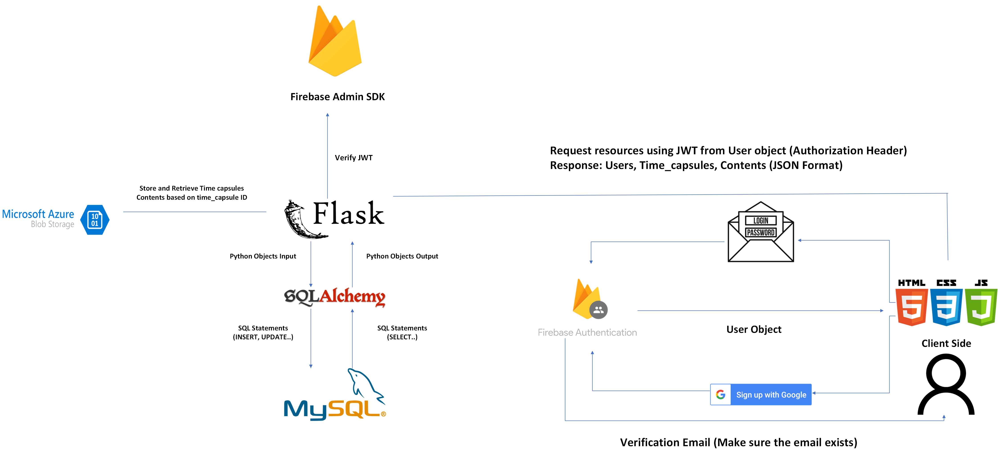

# Echoes Of Time

- _...capturing memories for the future_

## Description

Echoes of Time⏳: This is an innovative digital solution designed to allow users to store and share personal memories, messages, and multimedia content that can be unlocked at a future date. This project focuses on the secure and organized storage of these time capsules, ensuring that they remain intact and private until the designated unlock time.

## Architecture

## API Documentation

## Current Features

- **User Management**: Users can create accounts, log in securely, and manage their profiles.
- **Time Capsule Creation**: Users can create digital time capsules that contain text, images, videos, and other multimedia content.
- **Content Management**: Each time capsule can be customized with different types of content, stored securely in a Azure Blob Storage service (3rd Party Service) and or MySQL Database.
- **Unlock Dates**: Users can set specific dates when their time capsules will be unlocked, making it perfect for future gifts, messages, or memory sharing.
- **API Integration**: A robust set of APIs allows for seamless interaction with the database, making it easy for other applications to integrate with the TimeCapsule service.

## Future Enhancements

- `Additional Content Types`: Expand the range of content types that can be included in time capsules.
- `Notification System`: Implement a notification system to alert users when their time capsules are about to unlock.
- `Enhanced Error Handling`: Improve the logging and error-handling mechanisms for better reliability and user experience.
- `Frontend Development`: Develop a user-friendly frontend interface to enhance user interaction and engagement, making it a full-stack solution.

## Technologies

### Backend

- Python with SQLAlchemy for ORM, MySQL for database management, and a suite of RESTful APIs for data interaction.
  - Flask
  - MySQL
  - SQLAlchemy
  - Azure Blob Storage
- **Environment Management**: Use of environment variables for configuration and security, facilitated by the dotenv package.
- **Session Management**: Managed using SQLAlchemy's sessionmaker and scoped_session for database transactions.

### Frontend

- HTML
- CSS
- JavaScript
- Bootstrap

## Vision 🔭

The vision for Echoes of Time is to provide a secure and nostalgic way for people to preserve and share their memories and messages for the future. By developing a comprehensive frontend, we aim to deliver a full-stack application that offers a seamless and engaging user experience. This project not only showcases our backend development skills but also our potential to create holistic, end-to-end digital solutions.

## Potential Impact 🌟

Echoes of Time has the potential to revolutionize how people store and share personal memories and important messages. With secure storage and the ability to set future unlock dates, it offers a unique way to celebrate anniversaries, birthdays, and other significant life events. By expanding to a full-stack solution, we aim to capture a broader audience and provide a more interactive and user-friendly platform.

## Contributors

- Abdelwadoud Makhlok ([@AbdelwadoudMakh55](https://github.com/AbdelwadoudMakh55))
- Ayomide Kayode ([@AyomideKayode](https://github.com/AyomideKayode))
